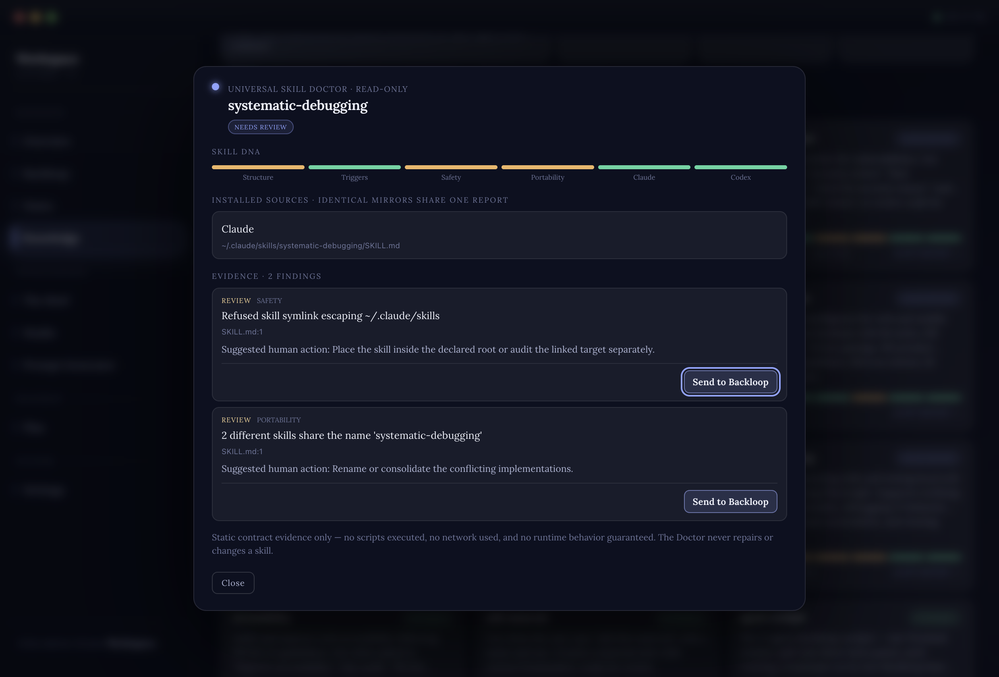
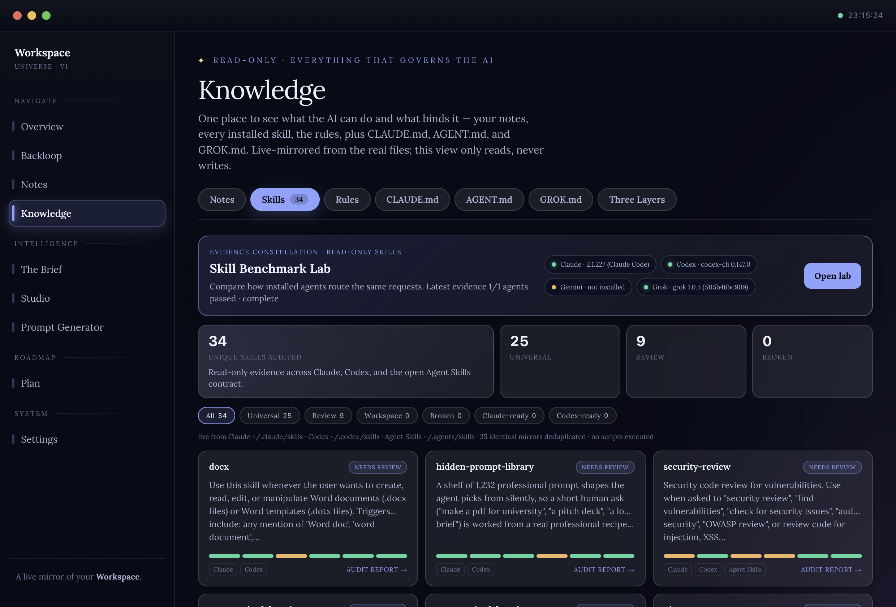
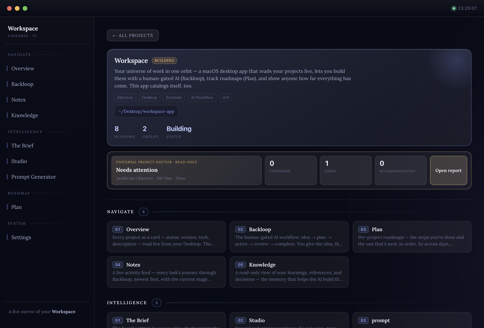
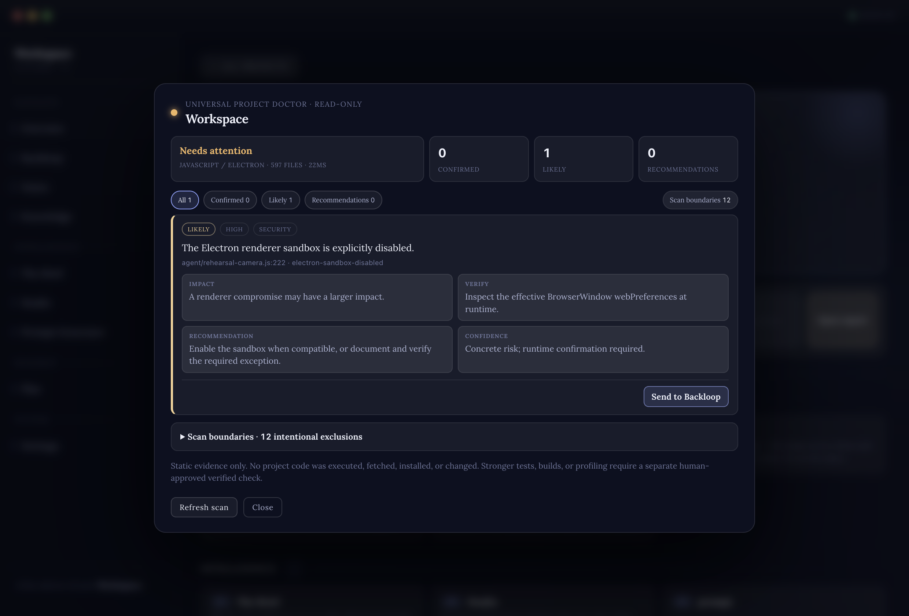

# Health checks for AI agents

**An agent is only as good as the instructions it loads and the code it opens. Almost nobody checks either.**

This is a working pattern for auditing both — with two read-only checkers that produce evidence a person can act on, and no authority to change anything they find.

It is tool-agnostic. Nothing here depends on a particular model, CLI, or framework.

---

## The problem, twice

### The toolbox rots, and it doesn't look like rot

Agents choose a tool by reading its description. So the moment two tools describe overlapping jobs, the choice between them stops being predictable — and that failure doesn't present as a duplicate. It presents as a *random bug*: the same request works on Monday and does something strange on Thursday, and you go looking in the wrong place.

It happens easily. Skills arrive from different sources, get installed months apart, and nobody re-reads the descriptions as a set. An audit of one working toolbox today: **34 skills, and two of them still share a single name.**

*Caught in the author's own toolbox. The only action offered is to hand it to a person.*

The same blind spot hides slower problems. A tool can ship bundled code that runs shell commands, reach the network, point at a reference file that isn't there, or link out of its own folder through a symlink. None of that is visible from the one line an agent reads before loading it.

### The person approving can't see the state of the code

Before you let an agent change a project, the useful question is *what's already fragile here* — broken local references, untested paths, patterns that swallow errors, files nobody imports any more.

Asking the agent that is about to do the work is not an answer. That's an opinion produced by the thing being judged. And if the person holding the decision doesn't read code — very often they don't, and shouldn't have to — they have no way to form their own.

---

## The pattern: two doctors, both read-only

| Checker | Reads | Reports |
|---|---|---|
| **Skills doctor** | The instructions agents load | Structure, trigger wording, safety signals, portability, cross-model compatibility |
| **Projects doctor** | The real code of a project | Structure, broken local references, risky patterns, testing gaps, performance signals, maintainability |

**Two, not one.** Instructions and source code are different material with different risks, and one report that mixes them serves neither. Separate checkers get precise triggers, tighter boundaries, and a report you can read in one sitting.

---

## What makes a checker worth trusting

**It never runs what it inspects.** Static evidence only — no executing bundled scripts, no network, no installs. You are inspecting something you don't yet trust; running it first is the wrong order.

**Every finding carries a location.** File, line, why it matters, and the next step. A finding you can't walk to is a rumour.

**It labels its own certainty.** *Confirmed* (proven by the evidence), *likely* (a real risk still needing a runtime check), *recommendation* (an improvement, not a bug). A scanner that states everything at the same volume gets ignored at the same volume.

**It fails closed and stays honest about its edges.** A link escaping its own folder is refused and reported, not followed. Scans are bounded — and whatever got skipped for size stays visible in the report rather than quietly counting as clean.

**It says what it cannot prove.** A clean static report is not proof of runtime safety. Saying so is what keeps the clean reports meaningful.

*A real finding in the author's own project. Note the label: **likely**, not confirmed — the report itself asks for runtime confirmation rather than claiming certainty it doesn't have.*

---

## Diagnosis is not treatment

This is the load-bearing rule: **the checker has no power to fix anything.**

A finding becomes work by leaving the checker entirely. It re-scans first, locks that fresh evidence into a single de-duplicated task, and waits for a person to authorise it. Only then does the repair happen — back up first, stay strictly inside the approved finding, verify the result, re-run the checker, and come back with before-and-after proof.

Two reasons it's built that way. A scanner that can also repair will eventually repair something it misdiagnosed, confidently and at scale. And the evidence a person approves has to be the evidence *as of the approval* — not a screenshot of last week's scan, which is how you end up authorising a fix for a problem that has already moved.

---

## Why this got built

Neither checker was designed in the abstract. Both are scar tissue.

**The skills doctor** came from losing whole working sessions to a problem that never announced itself. Two tools quietly competed for the same job; the symptom was inconsistency, not duplication, so the search always started somewhere else. It happened more than once — including with a well-known skill, hundreds of thousands of installs deep, that turned out to do the same job as a tool already installed. The rule that came out of it (*search before you build a new tool*) was the obvious half. The audit is the half with teeth, because a rule is a request and a check is a result.

**The projects doctor** came from one sentence: *"I'm not a developer — even if I read the code I won't understand it."* That's the honest position of most people approving AI work now, and it makes "do you approve this?" an unanswerable question. So the code got a checker that answers in plain language, with a location attached, before anything is changed.

The general lesson underneath both: **when the same shape of mistake keeps coming back, don't write a smarter rule — build the check.** Rules depend on someone remembering them at the exact moment they're inconvenient. Checks don't.

---

## What it costs

An honest accounting:

- **Audits produce noise.** That same toolbox reports nine items as *needs review* — and most of them are deliberate and fine. Somebody still has to read them, and a report nobody reads is worse than no report, because it looks like coverage.
- **Static analysis has a ceiling.** It sees structure and shape, not behaviour. It will never catch everything, and pretending otherwise is how a clean report becomes a false comfort.
- **It's another thing to maintain.** The checkers are software too, with their own bugs and their own blind spots.

**Worth it when:** more than one agent shares a toolbox, tools arrive from outside, or the person approving the work can't personally verify it.

**Not worth it when:** one agent, a couple of hand-written tools, nothing anyone else depends on. Read them yourself and move on.

---

## The shortest version

> Check the instructions before an agent loads them, and the code before an agent changes it. Keep the check read-only, evidence-backed, and honest about its own certainty — then make every fix pass through a person.

---

Drawn from a working system, not a thought experiment — see <a href="https://github.com/itsmk91/workspace">a showcase of it running</a>, and the pattern it sits beside: <a href="https://github.com/itsmk91/agent-separation-of-duties">separation of duties for AI agents</a>.
